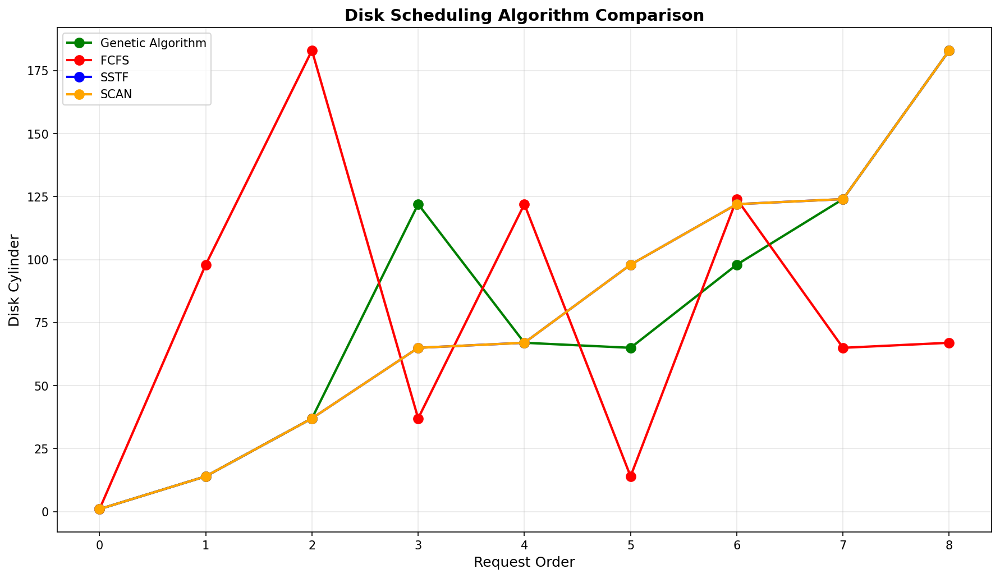

# AI-Based Disk Scheduling Algorithms

## 📌 Project Overview

This project implements and compares traditional Disk Scheduling Algorithms with an AI-based approach using a Genetic Algorithm (GA).
The goal is to minimize total disk head movement and improve efficiency.

---

## 🚀 Algorithms Implemented

* **FCFS (First Come First Serve)**
* **SSTF (Shortest Seek Time First)**
* **SCAN (Elevator Algorithm)**
* **Genetic Algorithm (AI-based optimization)**

---

## ⚙️ Features

* Computes total head movement for each algorithm
* Compares performance across algorithms
* Recommends the most efficient algorithm
* **Displays a graph showing disk head movement comparison**

---

## 🧠 Genetic Algorithm Approach

* Initial population generated using random permutations
* Fitness function: total head movement
* Selection of best candidates
* Crossover and mutation applied for optimization
* Iteratively improves solution over generations

---

## 🖥️ Sample Input

```
Enter disk requests: 98 183 37 122 14 124 65 67
Enter initial head position: 53
```

---

## 📊 Sample Output

```
Best GA Sequence: 65 -> 67 -> 98 -> 122 -> 124 -> 183 -> 37 -> 14
Total Head Movement (GA): 236

FCFS Sequence: 98 -> 183 -> 37 -> 122 -> 14 -> 124 -> 65 -> 67
Total Head Movement (FCFS): 640

SSTF Sequence: 65 -> 67 -> 37 -> 14 -> 98 -> 122 -> 124 -> 183
Total Head Movement (SSTF): 236

SCAN Sequence: 65 -> 67 -> 98 -> 122 -> 124 -> 183 -> 37 -> 14
Total Head Movement (SCAN): 299

Recommended Algorithm: SSTF
```

---

## 📈 Output Visualization

The program generates a graph comparing all algorithms:




---

## 🛠️ Tech Stack

* Python
* NumPy
* Matplotlib

---

## ▶️ How to Run

1. Clone the repository:

```
git clone https://github.com/BaldeepSinghBali/Disk-Scheduling-Algorithms.git
```

2. Navigate to the project folder:

```
cd Disk-Scheduling-Algorithms
```

3. Install dependencies:

```
pip install numpy matplotlib
```

4. Run the program:

```
python main.py
```

---

## 📌 Key Insight

The Genetic Algorithm provides an optimized solution by exploring multiple request sequences, often achieving performance comparable to or better than traditional algorithms.

---

## 📚 Future Enhancements

* Add more disk scheduling algorithms (LOOK, C-LOOK)
* Improve GA using adaptive mutation rates
* Build a GUI for better interaction

---

---
